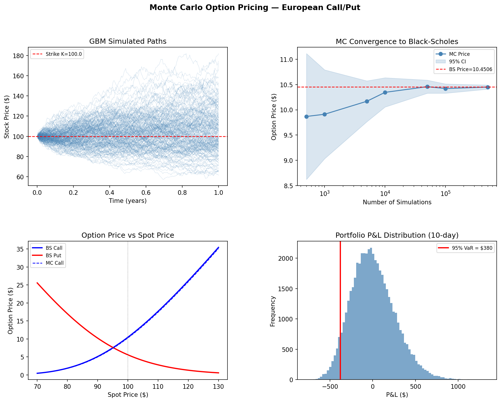

# Monte Carlo Option Pricing

European Call/Put option pricing via Monte Carlo simulation with Geometric Brownian Motion (GBM). Benchmarks against Black-Scholes closed-form, estimates Greeks via bump-and-reprice, and computes portfolio VaR.

## What it does

| Feature | Details |
|---|---|
| **GBM path simulation** | Vectorised exact-solution log-price increments (not Euler approximation) |
| **Option pricing** | European Call & Put via risk-neutral expectation over 100k paths |
| **Black-Scholes benchmark** | Closed-form verification — MC converges within ~0.3% |
| **Greeks** | Delta and Vega via central finite difference (bump-and-reprice) |
| **Portfolio VaR** | 10-day 95% Value-at-Risk for 100-contract call portfolio |
| **Convergence plot** | Shows MC price ± 95% CI converging to BS as N grows |

## Results (ATM Call: S=100, K=100, T=1yr, r=5%, σ=20%)

```
[CALL]
  MC Price : 10.4205  ±0.0917  (95% CI)
  BS Price : 10.4506
  Error    : 0.0300  (0.29%)
  Delta    : MC=0.6364  BS=0.6368
  Vega     : MC=37.45

[PUT]
  MC Price : 5.6122  ±0.0539  (95% CI)
  BS Price : 5.5735
  Error    : 0.0387  (0.69%)

Portfolio VaR (100 calls, 10-day, 95%): $380.14
```

## Plots generated



## Run

```bash
pip install numpy scipy matplotlib
python3 mc_options.py
```

## Key concepts

- **GBM**: dS = μS dt + σS dW — stock prices follow a log-normal distribution
- **Risk-neutral pricing**: simulate under Q-measure (drift = r), discount at risk-free rate
- **Greeks via bump-and-reprice**: Δ = (V(S+h) − V(S−h)) / 2h (central difference)
- **VaR**: worst loss not exceeded at given confidence level over a holding period
